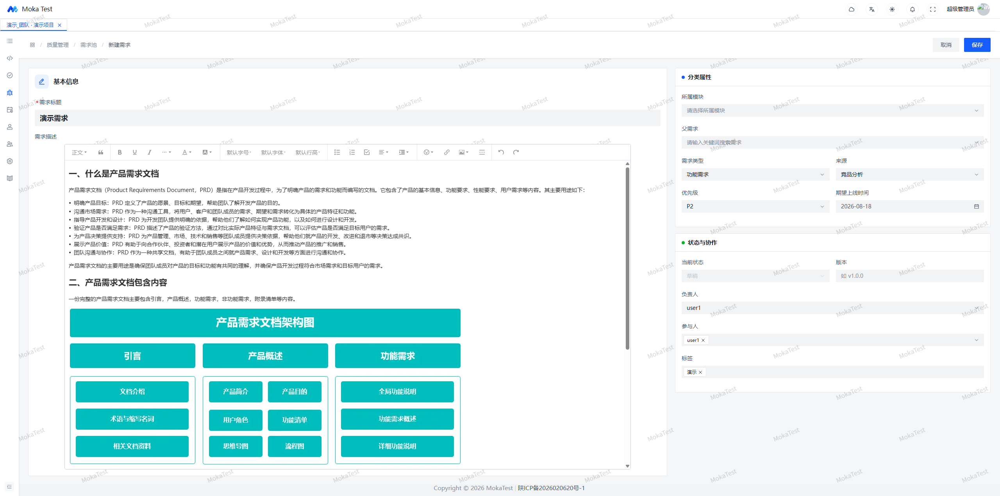
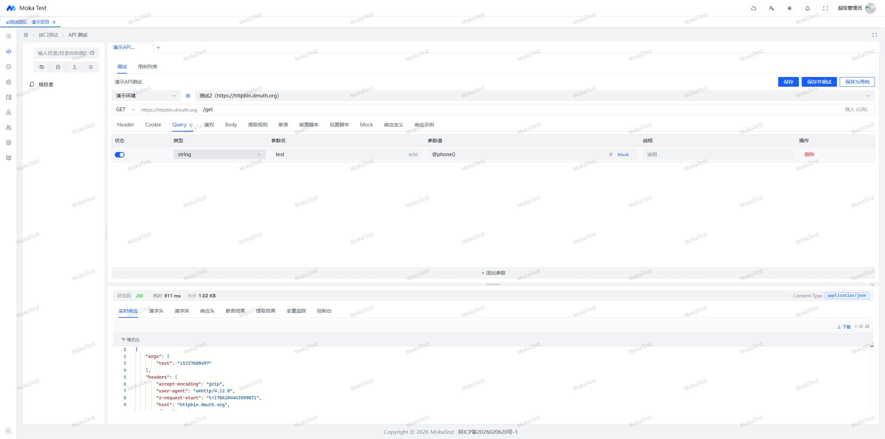
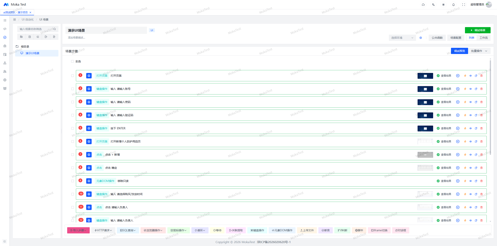
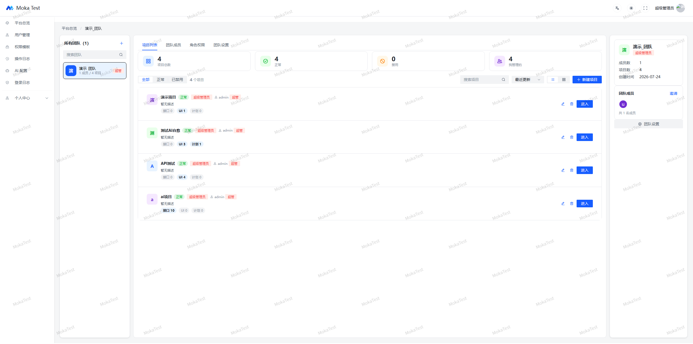
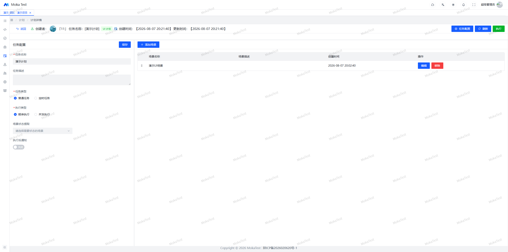
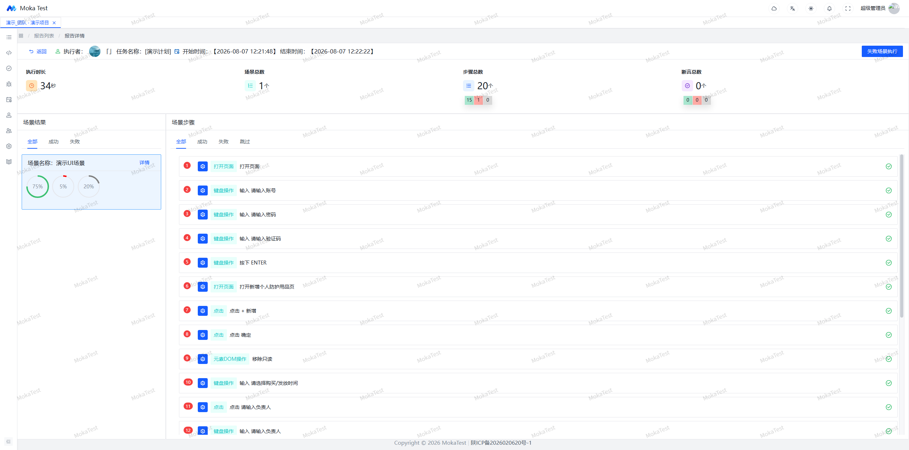

<p align="center">
  
</p>
<h3 align="center">一站式自动化测试平台</h3>
<p align="center">
  
  
  
  
  
</p>
<p align="center">
  <a href="https://mokatest.cn">在线演示</a>（账号 <code>mokatest</code> / <code>mokatest</code>） ·
  <a href="https://mokatest.cn/docs/">使用文档</a>
</p>
<p align="center">
  <a href="https://github.com/Jinglong233/MokaTest">GitHub</a> ·
  <a href="https://gitee.com/Jinglong233/MokaTest">Gitee（国内镜像）</a>
</p>

---

MokaTest 是面向测试团队的一站式自动化测试平台，覆盖从需求到报告的完整测试流程：

- **质量管理**：需求池（Epic/Story 层级）、BUG 池、测试用例、血缘追踪，缺陷全生命周期可追溯
- **API 测试**：接口调试、断言/提取/脚本、参数级 Mock、数据模板、多环境一键切换
- **UI 自动化**：场景可视化编排、元素库集中管理、调试支持暂停/断点/执行到指定步骤，定位失败时 AI 自动修复
- **测试计划**：定时/手动触发、并发执行、Webhook 通知、测试报告
- **团队协作**：团队/项目/成员三级权限隔离，角色灵活配置，站内信通知

## 项目状态

本项目目前处于早期阶段（v0.x），由个人独立开发维护：功能持续迭代中，接口和表结构可能变动；部分模块尚不完善，可能存在缺陷。生产环境使用请自行充分评估，也欢迎通过 Issue 反馈你遇到的问题。

## UI 展示

| 质量管理                          | API 测试                          |
|-------------------------------|---------------------------------|
|    |   |
| **UI 自动化**                    | **团队协作**                        |
|  |    |
| **计划任务**                      | **报告**                          |
|  |  |

## 技术栈

| 层级 | 技术 |
|------|------|
| 前端 | Vue 3 + Vite + Arco Design Vue + TypeScript |
| 后端 | Spring Boot 3 + MyBatis-Plus + Sa-Token |
| 数据库 | MySQL 8.0 |
| 其他 | Playwright（UI 自动化）、MinIO（文件存储）|

## 快速开始（Docker 一键部署）

```bash
git clone https://github.com/Jinglong233/MokaTest.git 
# git clone https://gitee.com/Jinglong233/MokaTest.git  #gitee 仓库

cp .env.example .env       # 按需修改密码和端口
docker compose up -d --build
```

首次构建需要拉取基础镜像和依赖，耗时较长，请耐心等待。启动完成后：

- 访问地址：`http://<服务器IP>`（端口由 `.env` 的 `HOST_HTTP_PORT` 控制，默认 80）
- 默认账号：`admin` / `abc123`（**生产部署请立即修改**）

服务包含：MySQL、后端、前端 Nginx、MinIO 对象存储，全部容器化，无需本机安装任何依赖。

## 本地开发

### 后端

```bash
# 准备数据库：创建数据库并导入表结构
mysql -u root -p < backEnd/sql/mokatest_full_schema.sql

cd backEnd
```

后端默认端口：`7529`

### 前端

```bash
cd frontEnd
yarn install
yarn dev
```

前端默认端口：`5173`（Vite 默认）

## 项目结构

```
MokaTest/
├── backEnd/                    # 后端服务
│   ├── platform-starter/       # 启动模块（Spring Boot 入口）
│   ├── platform-automation/    # UI/API 自动化测试核心模块
│   ├── platform-qa/            # 质量管理模块（需求/BUG/用例）
│   └── sql/                    # 数据库脚本
├── frontEnd/                   # 前端（Vue 3 + Arco Design）
├── docs/images/                # README 截图
├── docker-compose.yml          # Docker 一键部署
├── .env.example                # 环境变量模板
└── LICENSE                     # BSL 1.1
```

---

## 参与贡献

欢迎任何形式的参与：

- 遇到 Bug 或有功能建议，请提交 Issue（请尽量附上复现步骤、环境信息）
- 欢迎提交 Pull Request，较大改动建议先开 Issue 讨论方案
- 觉得项目有用，点个 Star 就是对作者最大的支持

---

## License

本项目采用 [Business Source License 1.1](LICENSE)（BSL）：

- 学习、测试、评估、非生产环境使用：**完全免费**
- 公司内网部署、内部业务自用（含生产环境）：**免费**，无需授权
- 以下用途需获得**商业授权**：将本软件作为托管/云服务提供给第三方；转售；包装进与作者构成竞争关系的产品或服务
- 每个版本发布满 4 年后自动转为 **Apache License 2.0**，届时可自由商用

商业授权请联系项目作者。

---

## 品牌与商标

- **MokaTest 名称与 Logo 不随代码协议授权**：你可以自由使用、修改、分发代码，但不得在对外发布的产品或服务中使用 MokaTest 名称或 Logo，以免造成混淆。
- 本项目界面中的 Logo 及部分配图为 AI 生成图片，未主张版权；如对素材有更高要求，可自行替换。
- 前端部分页面基于 [Arco Design Pro Vue](https://github.com/arco-design/arco-design-pro-vue)（MIT License）开发，其自带 banner 图片素材版权归原项目所有，遵循 MIT 协议使用，详见 [NOTICE](NOTICE)。

## 第三方组件与素材

本项目依赖的所有开源组件及其协议见 [NOTICE](NOTICE) 文件。
